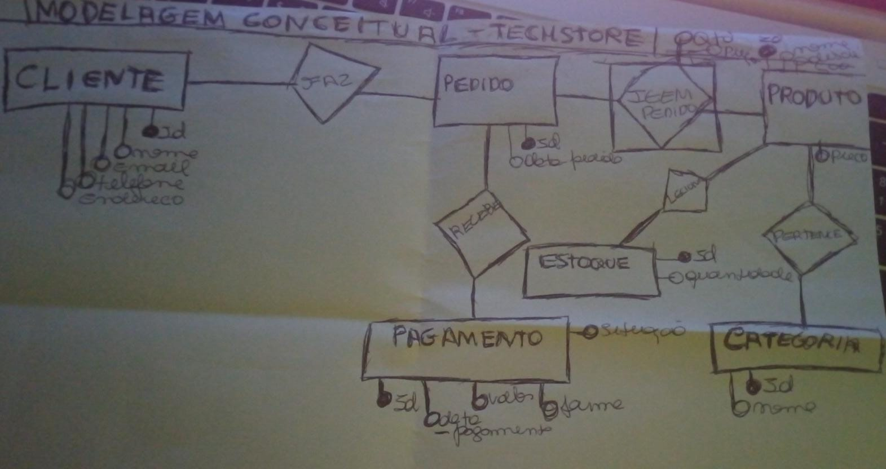

# Modelagem Conceitual

## 1. Objetivo

A modelagem conceitual tem como objetivo representar a estrutura inicial do sistema de e-commerce, identificando as principais entidades, seus atributos e os relacionamentos existentes entre elas.

Esta etapa foi construída a partir dos requisitos levantados junto ao cliente, transformando as necessidades do negócio em uma visão estruturada dos dados.

---

# 2. Entidades Identificadas

## Cliente

Representa os consumidores cadastrados no sistema.

Atributos:

* id_cliente
* nome
* email
* telefone
* endereco

## Produto

Representa os produtos comercializados pela loja.

Atributos:

* id_produto
* nome
* descricao
* preco

## Categoria

Representa a classificação dos produtos.

Atributos:

* id_categoria
* nome_categoria

## Pedido

Representa as compras realizadas pelos clientes.

Atributos:

* id_pedido
* data_pedido

## Pagamento

Representa as informações relacionadas ao pagamento de um pedido.

Atributos:

* id_pagamento
* data_pagamento
* valor
* forma_pagamento
* situacao

## Estoque

Representa o controle da quantidade disponível dos produtos.

Atributos:

* id_estoque
* quantidade

## Item_Pedido

Representa os produtos pertencentes a cada pedido, resolvendo o relacionamento muitos para muitos entre Pedido e Produto.

Atributos:

* quantidade
* preco_unitario

---

# 3. Relacionamentos

## Cliente realiza Pedido

Um cliente pode realizar vários pedidos.

Cardinalidade:

```
Cliente 1:N Pedido
```

---

## Categoria possui Produto

Uma categoria pode possuir vários produtos.

Um produto pertence a uma única categoria.

Cardinalidade:

```
Categoria 1:N Produto
```

---

## Produto possui Estoque

Cada produto possui um controle de estoque.

Cardinalidade:

```
Produto 1:1 Estoque
```

---

## Pedido possui Pagamento

Cada pedido possui um pagamento associado.

Cardinalidade:

```
Pedido 1:1 Pagamento
```

---

## Pedido contém Produto

Um pedido pode conter vários produtos e um produto pode estar presente em vários pedidos.

Inicialmente identificado como:

```
Pedido N:N Produto
```

Esse relacionamento foi resolvido através da entidade associativa:

```
Item_Pedido
```

Resultado:

```
Pedido 1:N Item_Pedido N:1 Produto
```

---

# 4. Entidade Associativa

## Item_Pedido

A entidade Item_Pedido foi criada para resolver o relacionamento muitos para muitos entre Pedido e Produto.

Ela permite armazenar informações específicas da relação, como:

* quantidade comprada;
* preço do produto no momento da compra.

---

# 5. Diagrama Entidade-Relacionamento (DER)

O modelo conceitual está representado visualmente através do diagrama:


