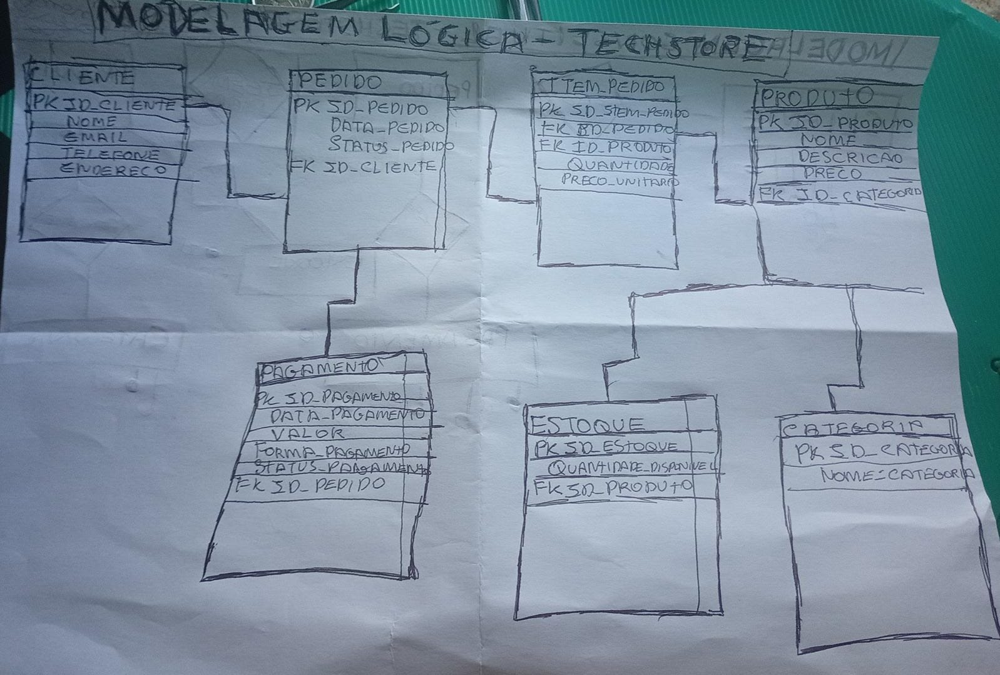

# Modelagem Lógica - Sistema de E-commerce

## 1. Objetivo

A modelagem lógica tem como objetivo transformar o modelo conceitual do sistema de e-commerce em uma estrutura organizada de tabelas, definindo:

- Entidades como tabelas;
- Atributos como campos;
- Chaves primárias;
- Chaves estrangeiras;
- Relacionamentos entre tabelas.

Essa etapa representa a preparação da estrutura que posteriormente será implementada no modelo físico do banco de dados.

---

# 2. Transformação do Modelo Conceitual para o Modelo Lógico

A partir dos requisitos levantados com o cliente e da modelagem conceitual, foram identificadas as seguintes tabelas:

## CLIENTE

Representa os usuários que realizam compras dentro do sistema.

### Atributos:

- id_cliente (PK)
- nome
- email
- telefone
- endereco

### Chave:

PK: id_cliente

---

# PRODUTO

Representa os produtos disponíveis para venda no e-commerce.

### Atributos:

- id_produto (PK)
- nome
- descricao
- preco
- quantidade_estoque
- id_categoria (FK)

### Chaves:

PK: id_produto

FK: id_categoria

---

# CATEGORIA

Representa a classificação dos produtos cadastrados.

### Atributos:

- id_categoria (PK)
- nome_categoria

### Chave:

PK: id_categoria

---

# PEDIDO

Representa uma compra realizada por um cliente.

### Atributos:

- id_pedido (PK)
- data_pedido
- status_pedido
- id_cliente (FK)

### Chaves:

PK: id_pedido

FK: id_cliente

---

# ITEM_PEDIDO

Tabela associativa criada para resolver o relacionamento muitos para muitos entre Pedido e Produto.

Um pedido pode possuir vários produtos e um produto pode estar presente em vários pedidos.

### Atributos:

- id_item_pedido (PK)
- id_pedido (FK)
- id_produto (FK)
- quantidade
- preco_unitario

### Chaves:

PK: id_item_pedido

FK: id_pedido

FK: id_produto

---

# PAGAMENTO

Representa as informações relacionadas ao pagamento de um pedido.

### Atributos:

- id_pagamento (PK)
- data_pagamento
- valor
- forma_pagamento
- status_pagamento
- id_pedido (FK)

### Chaves:

PK: id_pagamento

FK: id_pedido

---

# ESTOQUE

Representa o controle de quantidade disponível dos produtos.

### Atributos:

- id_estoque (PK)
- quantidade_disponivel
- id_produto (FK)

### Chaves:

PK: id_estoque

FK: id_produto

---

# 3. Relacionamentos e Cardinalidades

## Cliente e Pedido

Um cliente pode realizar vários pedidos.

Um pedido pertence a apenas um cliente.

Cardinalidade:

CLIENTE 1:N PEDIDO

---

## Pedido e Produto

Um pedido pode possuir vários produtos.

Um produto pode estar presente em vários pedidos.

Relacionamento original:

PEDIDO N:N PRODUTO

Como bancos relacionais não representam diretamente N:N, foi criada a tabela associativa:

PEDIDO 1:N ITEM_PEDIDO N:1 PRODUTO

---

## Categoria e Produto

Uma categoria pode possuir vários produtos.

Um produto pertence a uma categoria.

Cardinalidade:

CATEGORIA 1:N PRODUTO

---

## Pedido e Pagamento

Um pedido possui um pagamento.

Cardinalidade:
PEDIDO 1:1 PAGAMENTO

---

## Produto e Estoque

Cada produto possui seu controle de estoque.

Cardinalidade:

PRODUTO 1:1 ESTOQUE

---

# 4. Estrutura Final das Tabelas

A estrutura lógica final do sistema ficou:

CLIENTE
CATEGORIA
PRODUTO
PEDIDO
ITEM_PEDIDO
PAGAMENTO
ESTOQUE

Relacionamentos:

CLIENTE
|
| 1:N
|
PEDIDO
|
| 1:N
|
ITEM_PEDIDO
|
| N:1
|
PRODUTO
|
| N:1
|
CATEGORIA

PEDIDO
|
| 1:1
|
PAGAMENTO

PRODUTO
|
| 1:1
|
ESTOQUE

---

# 5. Próxima Etapa

Após a conclusão da modelagem lógica, o projeto seguirá para a modelagem física.

Na modelagem física serão definidos:

- SGBD escolhido;
- Tipos de dados;
- Constraints;
- Criação das tabelas SQL;
- Inserção dos dados;
- Consultas SQL;
- Índices.

## Diagrama da Modelagem Lógica

A representação visual da estrutura lógica do banco de dados é apresentada abaixo:

